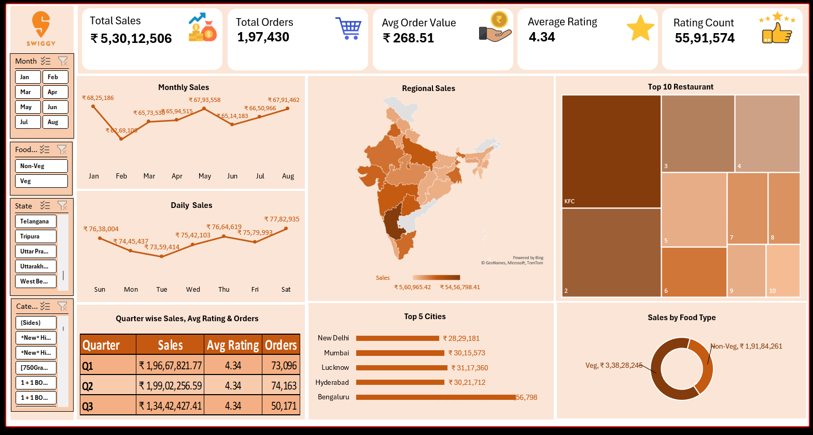

# 🍔 Swiggy Sales Analysis Dashboard (Excel)

## 📌 Project Overview

This project presents an interactive Sales Analysis Dashboard created in Microsoft Excel to analyze Swiggy food delivery sales performance.

The dashboard helps monitor revenue, orders, customer ratings, regional sales, food category performance, and city-wise insights using interactive slicers and charts.

---
## 📊 Dashboard Preview

---
## 🎯 Business Objectives

- Monitor Total Sales
- Track Total Orders
- Analyze Average Order Value
- Measure Customer Ratings
- Compare Regional Sales
- Identify Top Restaurants
- Compare Veg vs Non-Veg Sales
- Analyze Monthly & Daily Trends
- Evaluate Quarter-wise Performance

---

## 📈 Dashboard KPIs

- Total Sales
- Total Orders
- Average Order Value
- Average Rating
- Rating Count

---

## 📊 Dashboard Features

- Interactive Slicers
- Monthly Sales Trend
- Daily Sales Trend
- Regional Sales Map
- Top 10 Restaurants
- Top 5 Cities
- Quarter-wise Summary
- Sales by Food Type
- Dynamic Charts

---

## 🛠 Tools Used

- Microsoft Excel
- Pivot Tables
- Pivot Charts
- Slicers
- Conditional Formatting
- Maps
- KPI Cards

---

## 📂 Dataset

The dashboard is created using Swiggy sales data.

---

## 🚀 Key Insights

- Sales performance across multiple regions
- Best-performing restaurants
- Customer ordering trends
- Food category contribution
- City-wise sales comparison
- Quarterly business performance

---

## 👨‍💻 Author

Kaleem Asharaf

If you like this project, feel free to ⭐ this repository.
